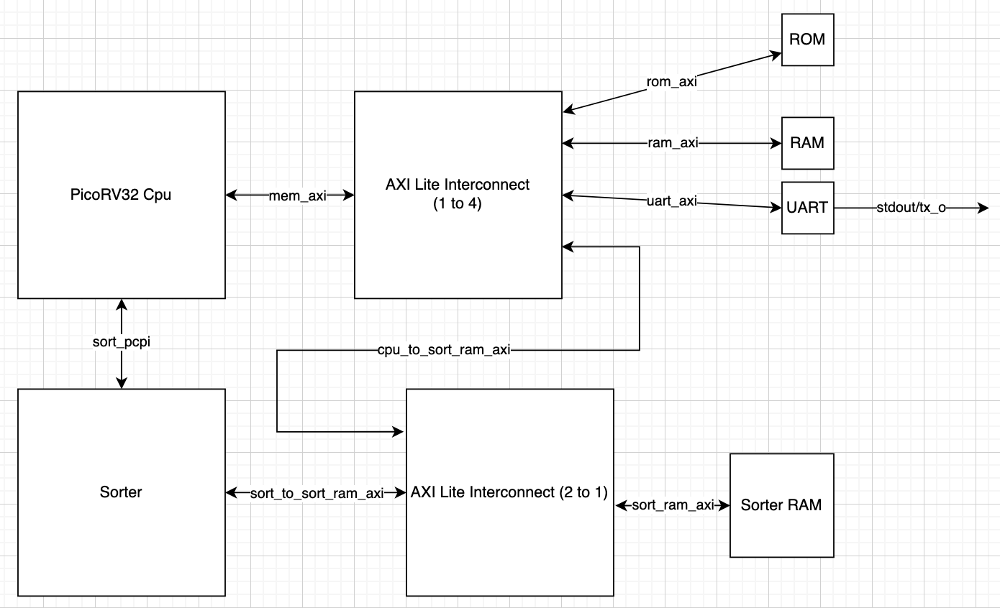
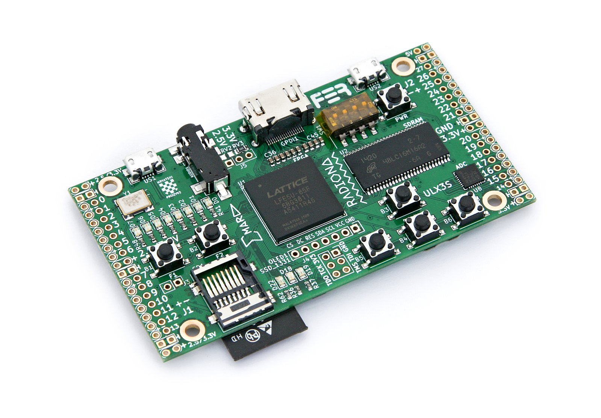
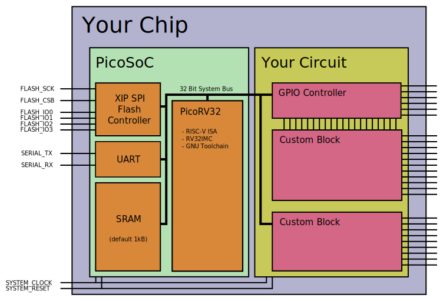
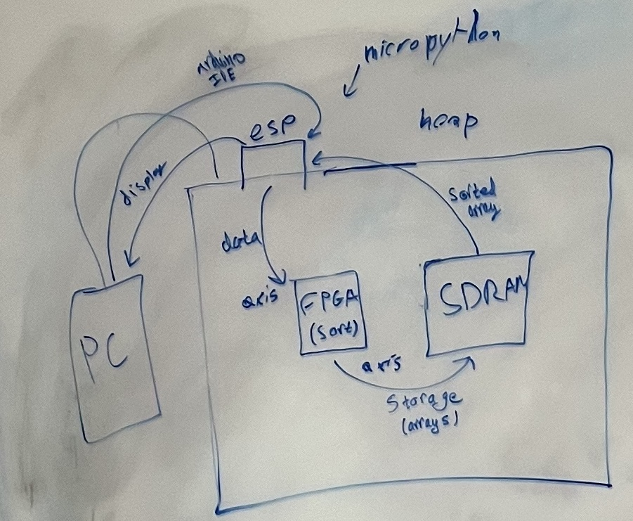

## Overview of Project

- Sorting algoritms are everywhere
  - Sorting task by priotory
  - Sorting names in a roster
- Simple enough to implement in software
  - At best most sorts have an O(nlog(n)) runtime
  - Can we do better in hardware?

---

### Architecture



---

### Hardware - ULX3S Development Board



---

### Specification

- FPGA: Lattice ECP5
  - LFE5U-85F-6BG381C (84 K LUT)
  - LFE5U-45F-6BG381C (44 K LUT)
  - LFE5U-12F-6BG381C (12 K LUT)
- USB: FTDI FT231XS (500 kbit JTAG and 3 Mbit USB-serial)
- RAM: 32 MB SDRAM 166 MHz
- Flash: 4-16 MB Quad-SPI Flash for FPGA config and user data storage
- LEDs: 11 (8 user LEDs, 2 USB LEDs, 1 Wi-Fi LED)
- Buttons: 7 (4 direction, 2 fire, 1 power button)
- Wi-Fi & Bluetooth: ESP32-WROOM-32 supports a standalone JTAG web interface over Wi-Fi

---

### Tool Flow

- YosysHQ's [OSS CAD Suite](https://github.com/YosysHQ/oss-cad-suite-build) on Github Codespaces
  - Yosys for Synthesis
  - nextpnr-ecp5 for place and route
  - ecppack for bitstrean generation
  - ecppll for PLL configuration
  - fujproj/openFPGALoader for programming
  - Verilator for simulation and linting
  - GTKWave for waveform viewing

## Components in Detail

## PicoRV32

- A Size-Optimized RISC-V CPU
  - Supports RV32IMC Instruction Set
  - Single Cycle
  - AXI Lite Interface Supported
  - PCPI Interface to interact with external cores
- Available from YosysHQ's [picorv32](https://github.com/YosysHQ/picorv32) repo

---

### Purpose of CPU

- CPU is to load the sorter's memory with integers
- After sorter signals that it is done, CPU "prints" out the array
  - CPU will just write to memory mapped IO to a UART module

---

### Pico Co-Processor Interface

- Checks this bus upon receiving an unsupported instruction
  - Sends this instruction to the sorter to begin sorting
  - Receives an instruction back to signal sorter is sorting or done
  - Requires C code to inline an instruction for sorting instead of compiling a function

---

### Bootloading and Compiler Infrastructure

- Requires a basic bootloader
  - Just an assembly file that sets all registers to 0, initializes SP, jumps to main and ebreak
  - Uses RISCV32I GCC cross compiler
  - Print functionality is memory mapped IO
  - Custom Linker Script to denote memory regions of binary

---

### Bootloader

```
start:
	addi x1, zero, 0
	addi x2, zero, 0
	addi x3, zero, 0
	addi x4, zero, 0
	addi x5, zero, 0
	addi x6, zero, 0
	addi x7, zero, 0
	addi x8, zero, 0
	addi x9, zero, 0
	addi x10, zero, 0
	addi x11, zero, 0
	addi x12, zero, 0
	addi x13, zero, 0
	addi x14, zero, 0
	addi x15, zero, 0
	addi x16, zero, 0
	addi x17, zero, 0
	addi x18, zero, 0
	addi x19, zero, 0
	addi x20, zero, 0
	addi x21, zero, 0
	addi x22, zero, 0
	addi x23, zero, 0
	addi x24, zero, 0
	addi x25, zero, 0
	addi x26, zero, 0
	addi x27, zero, 0
	addi x28, zero, 0
	addi x29, zero, 0
	addi x30, zero, 0
	addi x31, zero, 0
	/* set stack pointer */
	li sp,0x01005000
	/* call hello C code */
	jal main
	NOP
	ebreak
```

---

### Memory Regions

```
MEMORY {
	code : ORIGIN = 0x00000000, LENGTH = 0x00001000
	main_mem : ORIGIN = 0x01001000, LENGTH = 0x00004000
	sorter_mem : ORIGIN = 0x10005000, LENGTH = 0x00004000
}

SECTIONS {
    .text :
    {
        . = ALIGN(4);
        *(.text)
        *(.text*)
        *(.rodata)
        *(.rodata*)
        *(.srodata)
        *(.srodata*)
        . = ALIGN(4);
        _etext = .;
        _sidata = _etext;
    } >code
    .data : AT ( 0x1000 )
    {
        . = ALIGN(4);
        _sdata = .;
        _ram_start = .;
        . = ALIGN(4);
        *(.data)
        *(.data*)
        *(.sdata)
        *(.sdata*)
        . = ALIGN(4);
        _edata = .;
    } >main_mem
    .bss :
    {
        . = ALIGN(4);
        _sbss = .;
        *(.bss)
        *(.bss*)
        *(.sbss)
        *(.sbss*)
        *(COMMON)
        . = ALIGN(4);
        _ebss = .;
    } >main_mem
    .sorter_section : AT ( 0x5000 )
    {
        KEEP(*(.sorter_section))
    } >sorter_mem
}
```

---

### ELF Dump Contents

```
firmware/firmware.elf:     file format elf32-littleriscv


Disassembly of section .text:

00000000 <start>:
   0:	00000093          	li	ra,0
   4:	00000113          	li	sp,0
   8:	00000193          	li	gp,0
   c:	00000213          	li	tp,0
  10:	00000293          	li	t0,0
  14:	00000313          	li	t1,0
  18:	00000393          	li	t2,0
  1c:	00000413          	li	s0,0
  20:	00000493          	li	s1,0
  24:	00000513          	li	a0,0
  28:	00000593          	li	a1,0
  2c:	00000613          	li	a2,0
  30:	00000693          	li	a3,0
  34:	00000713          	li	a4,0
  38:	00000793          	li	a5,0
  3c:	00000813          	li	a6,0
  40:	00000893          	li	a7,0
  44:	00000913          	li	s2,0
  48:	00000993          	li	s3,0
  4c:	00000a13          	li	s4,0
  50:	00000a93          	li	s5,0
  54:	00000b13          	li	s6,0
  58:	00000b93          	li	s7,0
  5c:	00000c13          	li	s8,0
  60:	00000c93          	li	s9,0
  64:	00000d13          	li	s10,0
  68:	00000d93          	li	s11,0
  6c:	00000e13          	li	t3,0
  70:	00000e93          	li	t4,0
  74:	00000f13          	li	t5,0
  78:	00000f93          	li	t6,0
  7c:	01005137          	lui	sp,0x1005
  80:	224000ef          	jal	ra,2a4 <main>
  84:	00000013          	nop
  88:	00100073          	ebreak

0000008c <print_chr>:
  8c:	1100c737          	lui	a4,0x1100c
  90:	eef70793          	addi	a5,a4,-273 # 1100beef <arr+0x1006eef>
  94:	0ff57693          	andi	a3,a0,255
  98:	eef74603          	lbu	a2,-273(a4)
  9c:	eed707a3          	sb	a3,-273(a4)
  a0:	ef074703          	lbu	a4,-272(a4)
  a4:	000780a3          	sb	zero,1(a5)
  a8:	0027c703          	lbu	a4,2(a5)
  ac:	00078123          	sb	zero,2(a5)
  b0:	01855513          	srli	a0,a0,0x18
  b4:	0037c703          	lbu	a4,3(a5)
  b8:	00a781a3          	sb	a0,3(a5)
  bc:	00008067          	ret

000000c0 <print_str>:
  c0:	00054703          	lbu	a4,0(a0)
  c4:	02070e63          	beqz	a4,100 <print_str+0x40>
  c8:	1100c6b7          	lui	a3,0x1100c
  cc:	00150513          	addi	a0,a0,1
  d0:	0ff77613          	andi	a2,a4,255
  d4:	eef6c583          	lbu	a1,-273(a3) # 1100beef <arr+0x1006eef>
  d8:	eec687a3          	sb	a2,-273(a3)
  dc:	ef06c603          	lbu	a2,-272(a3)
  e0:	ee068823          	sb	zero,-272(a3)
  e4:	ef16c603          	lbu	a2,-271(a3)
  e8:	ee0688a3          	sb	zero,-271(a3)
  ec:	01875713          	srli	a4,a4,0x18
  f0:	ef26c603          	lbu	a2,-270(a3)
  f4:	eee68923          	sb	a4,-270(a3)
  f8:	00054703          	lbu	a4,0(a0)
  fc:	fc0718e3          	bnez	a4,cc <print_str+0xc>
 100:	00008067          	ret

00000104 <print_dec>:
 104:	ff010113          	addi	sp,sp,-16 # 1004ff0 <_edata+0x3ff0>
 108:	00410793          	addi	a5,sp,4
 10c:	00078613          	mv	a2,a5
 110:	00a00713          	li	a4,10
 114:	0140006f          	j	128 <print_dec+0x24>
 118:	00178793          	addi	a5,a5,1
 11c:	02e576b3          	remu	a3,a0,a4
 120:	fed78fa3          	sb	a3,-1(a5)
 124:	02e55533          	divu	a0,a0,a4
 128:	fe0518e3          	bnez	a0,118 <print_dec+0x14>
 12c:	fec786e3          	beq	a5,a2,118 <print_dec+0x14>
 130:	1100c637          	lui	a2,0x1100c
 134:	00410513          	addi	a0,sp,4
 138:	fff78793          	addi	a5,a5,-1
 13c:	0007c703          	lbu	a4,0(a5)
 140:	03070713          	addi	a4,a4,48
 144:	0ff77593          	andi	a1,a4,255
 148:	eef64803          	lbu	a6,-273(a2) # 1100beef <arr+0x1006eef>
 14c:	eeb607a3          	sb	a1,-273(a2)
 150:	00875593          	srli	a1,a4,0x8
 154:	ef064803          	lbu	a6,-272(a2)
 158:	eeb60823          	sb	a1,-272(a2)
 15c:	ef164583          	lbu	a1,-271(a2)
 160:	ee0608a3          	sb	zero,-271(a2)
 164:	01875713          	srli	a4,a4,0x18
 168:	ef264583          	lbu	a1,-270(a2)
 16c:	eee60923          	sb	a4,-270(a2)
 170:	fca794e3          	bne	a5,a0,138 <print_dec+0x34>
 174:	01010113          	addi	sp,sp,16
 178:	00008067          	ret

0000017c <swap>:
 17c:	fd010113          	addi	sp,sp,-48
 180:	02812623          	sw	s0,44(sp)
 184:	03010413          	addi	s0,sp,48
 188:	fca42e23          	sw	a0,-36(s0)
 18c:	fcb42c23          	sw	a1,-40(s0)
 190:	fdc42783          	lw	a5,-36(s0)
 194:	0007a783          	lw	a5,0(a5)
 198:	fef42623          	sw	a5,-20(s0)
 19c:	fd842783          	lw	a5,-40(s0)
 1a0:	0007a703          	lw	a4,0(a5)
 1a4:	fdc42783          	lw	a5,-36(s0)
 1a8:	00e7a023          	sw	a4,0(a5)
 1ac:	fd842783          	lw	a5,-40(s0)
 1b0:	fec42703          	lw	a4,-20(s0)
 1b4:	00e7a023          	sw	a4,0(a5)
 1b8:	00000013          	nop
 1bc:	02c12403          	lw	s0,44(sp)
 1c0:	03010113          	addi	sp,sp,48
 1c4:	00008067          	ret

000001c8 <bubbleSort>:
 1c8:	fd010113          	addi	sp,sp,-48
 1cc:	02112623          	sw	ra,44(sp)
 1d0:	02812423          	sw	s0,40(sp)
 1d4:	03010413          	addi	s0,sp,48
 1d8:	fca42e23          	sw	a0,-36(s0)
 1dc:	fcb42c23          	sw	a1,-40(s0)
 1e0:	fe042623          	sw	zero,-20(s0)
 1e4:	09c0006f          	j	280 <bubbleSort+0xb8>
 1e8:	fe042423          	sw	zero,-24(s0)
 1ec:	0700006f          	j	25c <bubbleSort+0x94>
 1f0:	fe842783          	lw	a5,-24(s0)
 1f4:	00279793          	slli	a5,a5,0x2
 1f8:	fdc42703          	lw	a4,-36(s0)
 1fc:	00f707b3          	add	a5,a4,a5
 200:	0007a703          	lw	a4,0(a5)
 204:	fe842783          	lw	a5,-24(s0)
 208:	00178793          	addi	a5,a5,1
 20c:	00279793          	slli	a5,a5,0x2
 210:	fdc42683          	lw	a3,-36(s0)
 214:	00f687b3          	add	a5,a3,a5
 218:	0007a783          	lw	a5,0(a5)
 21c:	02e7da63          	bge	a5,a4,250 <bubbleSort+0x88>
 220:	fe842783          	lw	a5,-24(s0)
 224:	00279793          	slli	a5,a5,0x2
 228:	fdc42703          	lw	a4,-36(s0)
 22c:	00f706b3          	add	a3,a4,a5
 230:	fe842783          	lw	a5,-24(s0)
 234:	00178793          	addi	a5,a5,1
 238:	00279793          	slli	a5,a5,0x2
 23c:	fdc42703          	lw	a4,-36(s0)
 240:	00f707b3          	add	a5,a4,a5
 244:	00078593          	mv	a1,a5
 248:	00068513          	mv	a0,a3
 24c:	f31ff0ef          	jal	ra,17c <swap>
 250:	fe842783          	lw	a5,-24(s0)
 254:	00178793          	addi	a5,a5,1
 258:	fef42423          	sw	a5,-24(s0)
 25c:	fd842703          	lw	a4,-40(s0)
 260:	fec42783          	lw	a5,-20(s0)
 264:	40f707b3          	sub	a5,a4,a5
 268:	fff78793          	addi	a5,a5,-1
 26c:	fe842703          	lw	a4,-24(s0)
 270:	f8f740e3          	blt	a4,a5,1f0 <bubbleSort+0x28>
 274:	fec42783          	lw	a5,-20(s0)
 278:	00178793          	addi	a5,a5,1
 27c:	fef42623          	sw	a5,-20(s0)
 280:	fd842783          	lw	a5,-40(s0)
 284:	fff78793          	addi	a5,a5,-1
 288:	fec42703          	lw	a4,-20(s0)
 28c:	f4f74ee3          	blt	a4,a5,1e8 <bubbleSort+0x20>
 290:	00000013          	nop
 294:	02c12083          	lw	ra,44(sp)
 298:	02812403          	lw	s0,40(sp)
 29c:	03010113          	addi	sp,sp,48
 2a0:	00008067          	ret

000002a4 <main>:
 2a4:	fe010113          	addi	sp,sp,-32
 2a8:	00112e23          	sw	ra,28(sp)
 2ac:	00812c23          	sw	s0,24(sp)
 2b0:	02010413          	addi	s0,sp,32
 2b4:	fe042623          	sw	zero,-20(s0)
 2b8:	0340006f          	j	2ec <main+0x48>
 2bc:	00001737          	lui	a4,0x1
 2c0:	fec42783          	lw	a5,-20(s0)
 2c4:	40f70733          	sub	a4,a4,a5
 2c8:	100057b7          	lui	a5,0x10005
 2cc:	fec42683          	lw	a3,-20(s0)
 2d0:	00269693          	slli	a3,a3,0x2
 2d4:	00078793          	mv	a5,a5
 2d8:	00f687b3          	add	a5,a3,a5
 2dc:	00e7a023          	sw	a4,0(a5) # 10005000 <arr>
 2e0:	fec42783          	lw	a5,-20(s0)
 2e4:	00178793          	addi	a5,a5,1
 2e8:	fef42623          	sw	a5,-20(s0)
 2ec:	fec42703          	lw	a4,-20(s0)
 2f0:	000017b7          	lui	a5,0x1
 2f4:	fcf744e3          	blt	a4,a5,2bc <main+0x18>
 2f8:	000015b7          	lui	a1,0x1
 2fc:	100057b7          	lui	a5,0x10005
 300:	00078513          	mv	a0,a5
 304:	ec5ff0ef          	jal	ra,1c8 <bubbleSort>
 308:	00000013          	nop
 30c:	01c12083          	lw	ra,28(sp)
 310:	01812403          	lw	s0,24(sp)
 314:	02010113          	addi	sp,sp,32
 318:	00008067          	ret
```

## Sorter

- Has both PCPI and AXI Lite interfaces
- TBA

## Memory

### AXI Lite RAM

- Taken from Alex Forencich's [verilog-axi](https://github.com/alexforencich/verilog-axi) repo
- Standard RAM module with AXI Lite signal handling
  - This handles proper communication of memory from Pico
- Used for general CPU main memory and shared sorter memory

---

### AXI Lite ROM

- Modified AXI Lite RAM module to use `$readmemh` function
- Acts as instruction memory for the Pico
- Does not synthesize to BRAM on ECP5

## Communication

---

### AXI Lite UART Module

- Taken from Dan Gisselquist's [wbuart32](https://github.com/ZipCPU/wbuart32/tree/master) repo
- Wishbone interface UART module but with an AXI Lite Version
- Acts as stdout for our design



### AXI Lite Interconnect

- Taken from Alex Forencich's [verilog-axi](https://github.com/alexforencich/verilog-axi) repo
- Act as a multiplexor or demultiplexor for AXI Lite signals
- Pico communications with 4 different AXI Lite Peripherals
  - This requires a 1 to 4 Interconnect
- Sorter RAM has two different users - sorter and Pico
  - This requires a 2 to 1 Interconnect
- Provided Python script generates the appriopriate wrapper module for each use case

## Outcomes

TBA

## Challenges

Several...

---

### Original Design



---

### Why ESP32 Failed

- Requires either a vendor specific bitstream and passthru logic to bypass the FTDI chip from programming the FPGA and
  target the ESP32
  - This is required as there is only 1 FTDI chip onboard
  - Documentation hazy on whether this another IP or required to be our top module
- Unclear which pins are even connected to the FPGA to use for UART communication between the ESP32
- ESP-IDF does not seem to target the ESP32 but the Arduino IDE does
  - Unclear if the Arduino Serial library is using the pins we want

---

### Why AXI Stream Failed

- Memories are not streamable targets
- AXI Stream has no destination
  - The other end of the wire is the destination
- With a read and write port it is unclear who asserts ready
- AXI Lite scales better due to interconnect support
  - Want to add another module? -> Just make a new address for it

---

### Why SDRAM Failed

- Unclear if the 166MHz clock is data output or what the internal FSM runs at
  - Would require a CDC FIFO for safe data transfer
- Verification is a pain
  - Verilog models are available for the specific memory but require industry tools to run as these are protected Verilog files (.vp)

## Demo / Simulation

## Qustions and Answers

## Thanks for watching

- Want to contribute to the sorting accelerator?

  - [https://github.com/gmejiamtz/sorting_accelerator](https://github.com/gmejiamtz/sorting_accelerator)

- Want to contribute to a repository of C programs for the PicoRV32?

  - [https://github.com/gmejiamtz/picorv32i_programs](https://github.com/gmejiamtz/picorv32i_programs)

- Want to make your own project on the ULX3S or another ECP5 FPGA?

  - [https://github.com/gmejiamtz/ecp5-project-template](https://github.com/gmejiamtz/ecp5-project-template)
